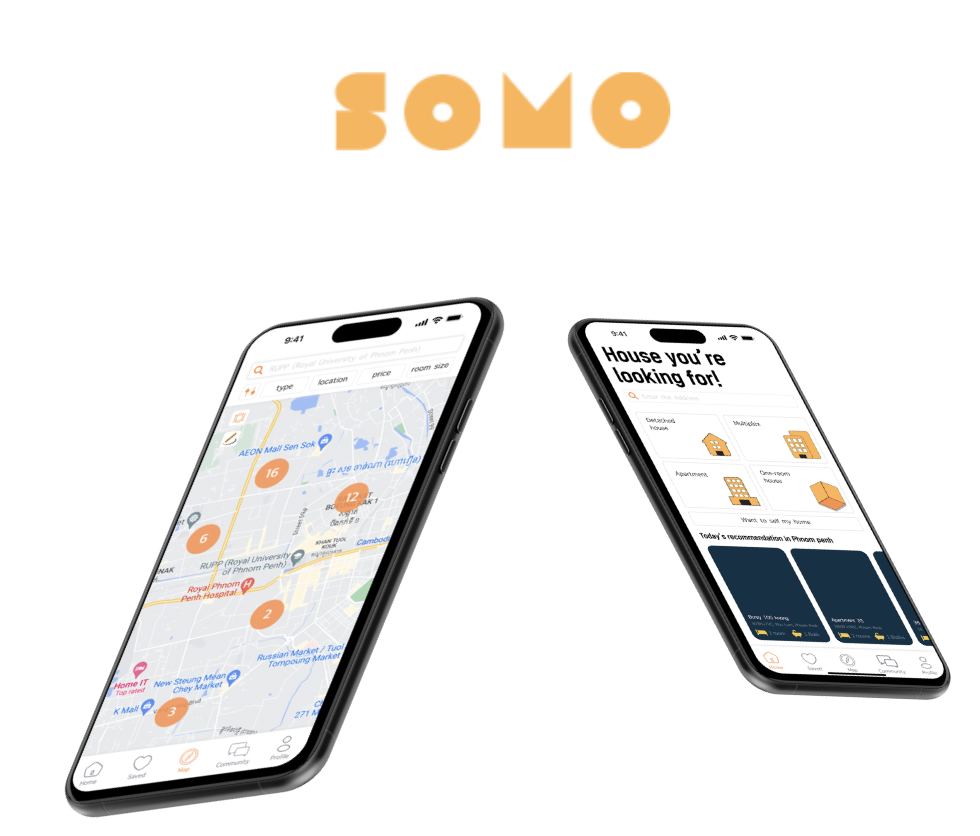
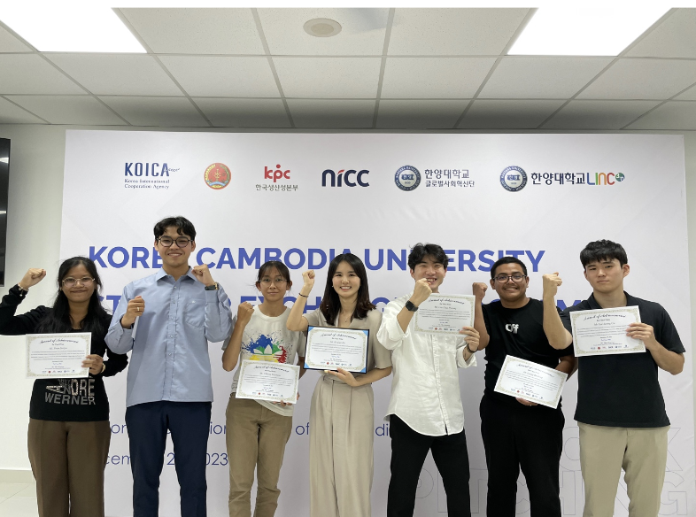
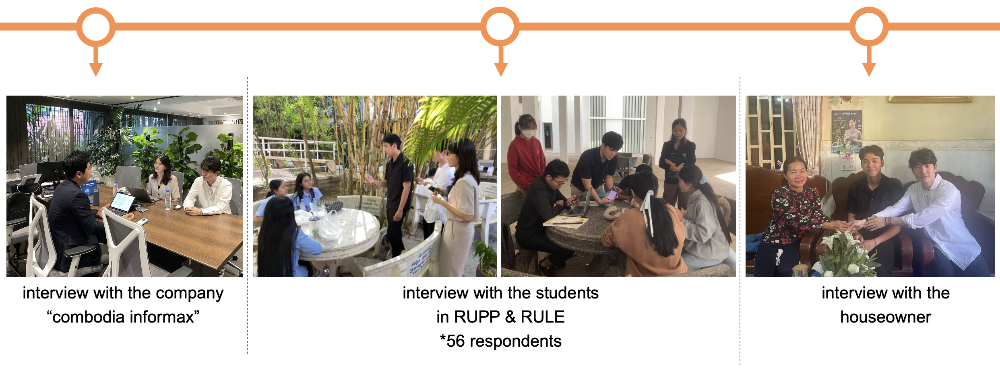

# SOMO

---

## Overview

- Koica 창업 인큐베이팅 때 진행했던 프로젝트
- 캄보디아 시장에서 SDGS 가치를 창출하는 사업 아이템 기획
- 캄보디아 학생 4명, 한국 학생 3명이서 진행

캄보디아내 프롭테크 산업이 부족하다는 점에 착안하여 캄보디아 대학생들을 위한 부동산 중개 어플리케이션을 기획하였습니다.

부동산 매물 조회, 룸메이트 찾기 기능, 채팅 등의 기능을 간단하게 프로토타입으로 구현하였습니다. 

Flutter와 Firebase를 활용하여 구현하였고, 기획과 개발 역할을 담당했습니다.

프로그램 진행 과정: 기획 → 시장조사 → 디자인 → 프로토타입 개발

전반적인 창업 과정을 이해할 수 있었고, 외국인 친구들과 해본 첫 프로젝트인 만큼 많은점을 배울 수 있었습니다.

실제 캄보디아내에서 진행한 설문조사입니다. 총 56명의 RUPP학생들에게서 앱에 대한 설문조사를 진행하였습니다. 그 밖에 캄보디아내 부동산 투자를 진행하는 한인회사 및 집주인에 대해서도 인터뷰를 진행했습니다.

## 소스

앱 소개 영상

앱 소개 영상

https://www.youtube.com/watch?v=_mibpCDelLM

캄보디아 학생 세입자 & 집주인 인터뷰 영상

https://www.youtube.com/watch?v=9jjChZmX4Nw

---

# 회고

프로젝트 초기에는 문화적, 언어적 차이때문에 프로젝트의 진행이 원활하지 않았다. 하지만 팀원들 모두가 열정적으로 회의에 참여해 주었고 신뢰형성을 할 수 있었다. 

프로젝트 후반부 우리 팀이 다른 팀들보다 우위를 점할 수 있는 방법을 모색했다. 우리가 가진 개발 능력이 팀의 강점이 될 수 있음을 깨닫고, 남은 시간 동안 Flutter를 활용해 프로토타입을 개발하기로 결정했다.

짧은 기간이었으나, 성공적인 프로토타입 완성과 탄탄한 기획을 바탕으로  프로그램에서 대상을 수상할 수 있었다고 생각한다.

- 경쟁팀에 비해 높은 팀워크 → 차별화된 현지화 & 구체적인 타겟시장
    - 협업의 중요성
- 현지화의 중요성
    - 캄보디아에는 공인중개사같은 부동산 중개업이 없어 서비스 개념을 이해하지 못함
    - 매물 신뢰도 문제
    - 낮은 인터넷/스마트폰 보급량
    - 낮은 대학 진학률
- 시장조사, 기획 멤버와의 소통 중요성 →  개발 로직 및 진행도에 악영향